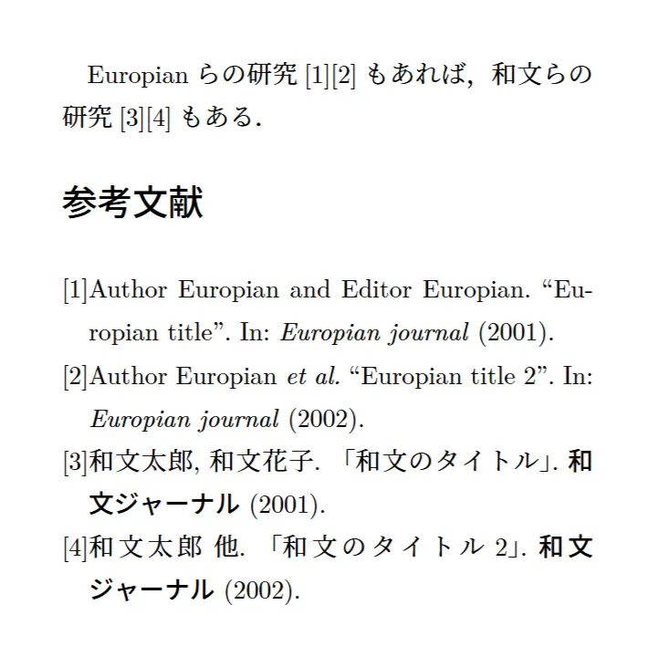

[LaTeX](../tags/latex.md)

# BibLaTeXで欧文和文を混ぜる

## はじめに

BibLaTeXはBibTeXより新しく便利な部分もあるものの、日本語への対応状況が芳しくありません。先人が[こういうもの](https://github.com/kmaed/biblatex-japanese.git)を残したりしていますが、残念ながら手元であんまり上手く動かなかったので、半ばごり押しで以下の項目を実装します。

| 列1 | 欧文の文献 | 和文の文献 |
|-----|-----|-----|
| 連名著者の省略 | et al. | 他 |
| 連名著者の区切り | hoge, fuga, and piyo. | hoge, fuga, piyo. |
| 文献のタイトル | ``Title'' | 「タイトル」 |
| 会議・ジャーナル名の区切り | In: Hoge Conference | 何とか会議（In: 無し） |

## 環境

- Overleaf / Ubuntu(TeXLive-full)
- (u)pLaTeX（LuaLaTeXだともう少し別な方法がありそう…）

## bibファイル

和文の文献だけ、最後に`langid=Japanese`を追加しておきます。ここが唯一の手動ポイントなのでどうにか自動化したいところですが、論文1本の中に含まれる和文の文献の数って（少なくとも理工系においては）高が知れているという印象なので、まあ良いでしょう。

```txt{20,28}
@article{Europian2001,
  title   = {Europian title},
  author  = {Europian, Author and Europian, Editor},
  journal = {Europian journal},
  date    = 2001
}

@article{Europian2002,
  title   = {Europian title 2},
  author  = {Europian, Author and Europian, Editor and Europian, Director},
  journal = {Europian journal},
  date    = 2002
}

@article{Japanese2001,
  title     = {和文の文献},
  author    = {和文太郎 and 和文花子},
  journal   = {和文ジャーナル},
  date      = 2001,
  langid    = {Japanese}
}

@article{Japanese2002,
  title     = {和文の文献 2},
  author    = {和文太郎 and 和文花子 and 和文次郎},
  journal   = {和文ジャーナル},
  date      = 2002,
  langid    = {Japanese}
}
```

## プリアンブル

上で追加した`langid`によって文献ごとに欧文or和文を判別して処理を行います。

厄介なのは著者名省略の処理で、それ用のコマンドがbabelパッケージに依存？しているのに、babelパッケージが`japanese`をサポートしてくれていません。もっとも設定した言語そのものが文献リストに影響する訳ではなく、設定した言語ごとに特有の処理を行うというだけなので、`japanese`は便宜的に`british`で代用することにします。

```tex
\documentclass[uplatex, twocolumn]{jlreq} % jsarticleでも可

\usepackage[style=numeric-comp]{biblatex} % BibLaTeXパッケージ読み込み
\addbibresource{ref.bib} % bibファイルを登録
\ExecuteBibliographyOptions{ % 追加オプション（他にも色々）
  sorting = none, % 引用した順に並べる
  maxnames = 2, % 連名になっている著者の数がmaxnamesを超えると、
  minnames = 1 % 初めのminnames人だけ表記されて残りは省略される
}

% ここまでは常套手段、検索結果も多数
% ===============================================================================
% ここから奥の手

\usepackage[british, english]{babel}
% babelパッケージにjapaneseは無いらしい
% 以下のDefineBiblio~コマンドを使いたいけれど言語設定が必要なので、
% 便宜的にjapaneseの代わりにbritishを割り当てておく
\DefineBibliographyStrings{british}{andothers={他}} % 和文の文献なら「他」
\DefineBibliographyStrings{english}{andothers={\textit{et al.}}} % 斜体にする

\AtEveryBibitem{ % bibファイルの文献を走査してゆく
    \iffieldequalstr{langid}{Japanese}{ % if: langid=Japaneseとした文献のみピックアップ
        \selectlanguage{british} % 言語をbritishにすることでandothers={他}が適用される
        \DeclareDelimFormat{finalnamedelim}{ % 区切り文字の設定
        \ifnumgreater{\value{liststop}}{2}{\finalandcomma}{} % 「and」を使わせない
            \addspace\multinamedelim }
        \DeclareFieldFormat*{title}{「#1」} % 論文のタイトルを鍵括弧で囲む
        \DeclareFieldFormat[book]{title}{『#1』} % 書籍なら二重鍵括弧
        \renewbibmacro{in:}{} % ジャーナル名の前の「In:」を除去
        }{% ここまでが和文の文献に限った処理
    \selectlanguage{english}} % else: 欧文の文献はデフォルト（english）の処理で良い
}

% 奥の手ここまで（プリアンブル終了）
```

## 本文

:::details おそらくlatexmkrcも必要

```perl
#!/usr/bin/env perl

$latex = "find . -type f -name '*.tex' -print0 | xargs -0 sed -i '' -e 's/、/，/g' -e 's/。/．/g'; uplatex -synctex=1 -halt-on-error -interaction=nonstopmode -file-line-error %O %S";

$dvipdf     = 'dvipdfmx -V 1.6 %O -o %D %S';
$makeindex  = 'mendex -U %O -o %D %S';
$bibtex     = 'upbibtex %O %S';
$biber      = 'biber --bblencoding=utf8 -u -U --output_safechars %O %S';
$max_repeat = 5;
$pdf_mode   = 3;

# フォント関連
$ENV{TZ} = 'Asia/Tokyo';

# プレビュー関連
$pvc_view_file_via_temporary = 0;
if ($^O eq 'linux') {
    $dvi_previewer = "xdg-open %S";
    $pdf_previewer = "xdg-open %S";
} elsif ($^O eq 'darwin') {
    $dvi_previewer = "open %S";
    $pdf_previewer = "open %S";
} else {
    $dvi_previewer = "start %S";
    $pdf_previewer = "start %S";
}
```

:::

```tex
\begin{document}
    Europianらの研究\cite{Europian2001}\cite{Europian2002}もあれば、%
    和文らの研究\cite{Japanese2001}\cite{Japanese2002}もある。

    % \renewcommand{\bibfont}{\footnotesize}
    \printbibliography[title = 参考文献]
\end{document}
```

## 結果


