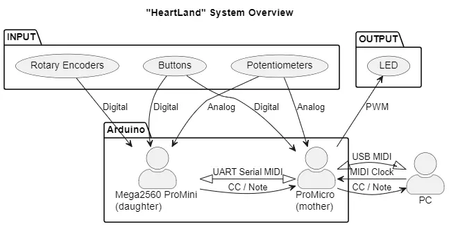
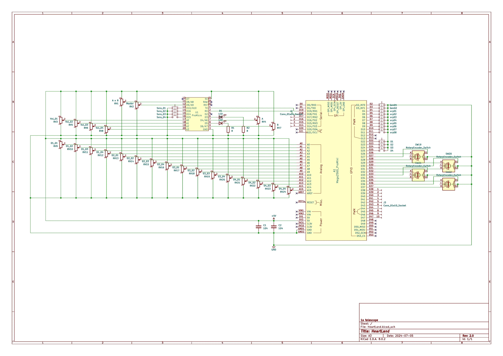
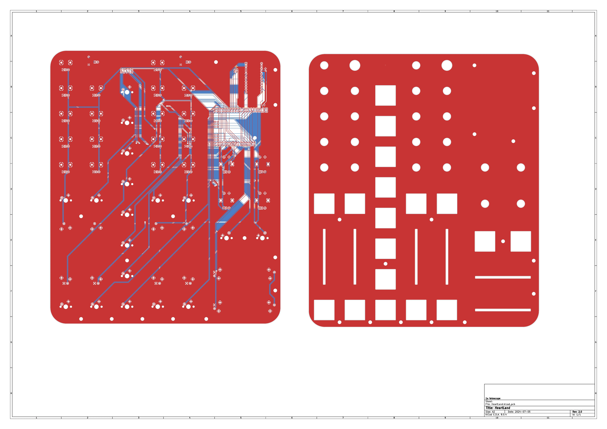
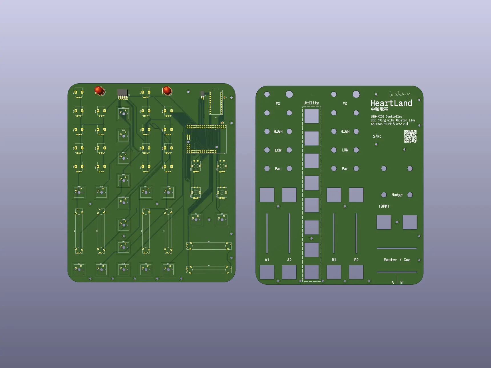
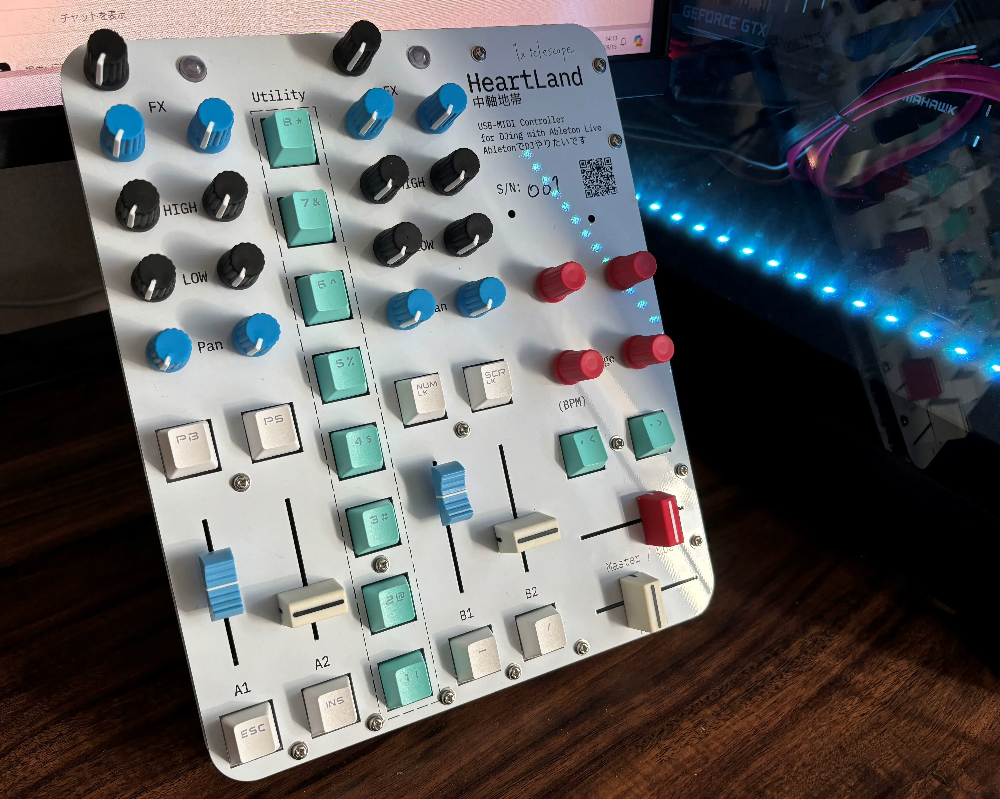
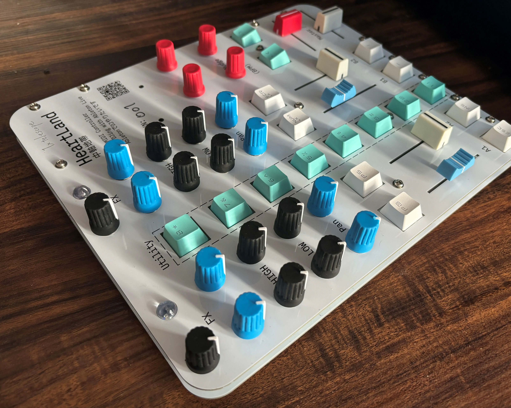
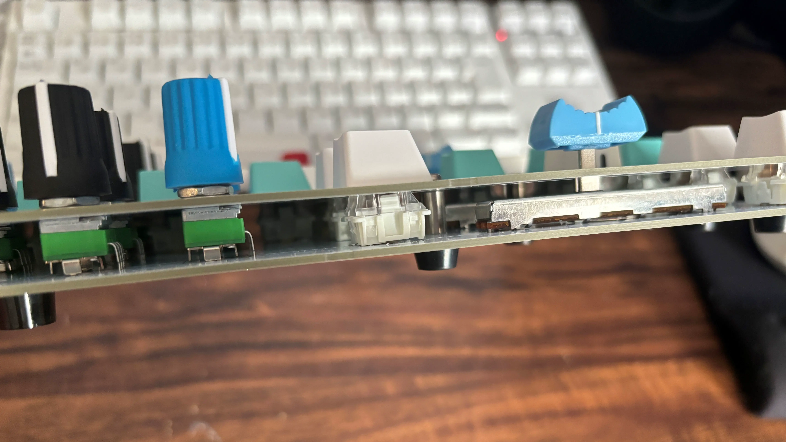
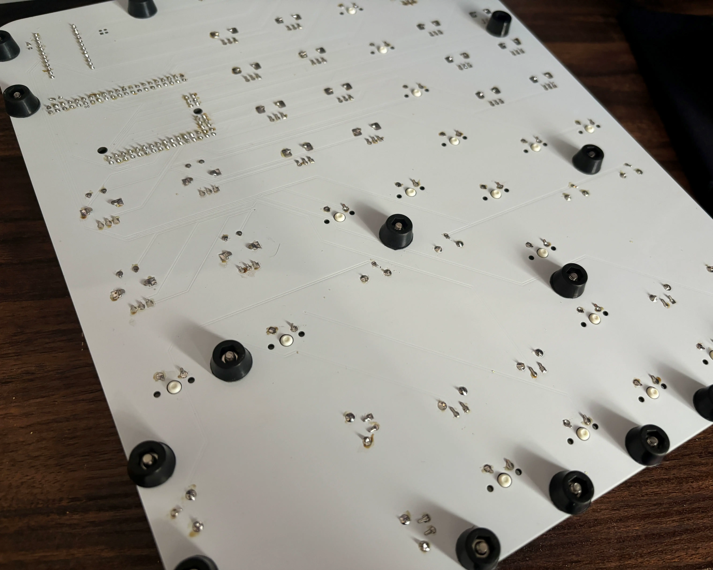

[その他の工作](../tags/otherdiy) | [MIDI](../tags/midi) | [Arduino](../tags/arduino)

# Arduinoで理想のMIDIコントローラーを作る

## はじめに

「ぼくがかんがえたさいきょうの MIDI コントローラー」を作ったので、その工程をまとめました。ソースコードや回路図は GitHub にも載せています。

https://github.com/aSumo-1xts/MIDI-HARD/tree/main/HeartLand

## 環境

- Windows 11
- Arduino IDE 2.3.3
- KiCad 8.0.2
- Ableton Live 12 Suite

## 背景と目的

Ableton Live で DJ をやりたいんですが、MIDI コントローラーの選択肢が少なすぎる！求める機能をそれなりに備えているのは Akai APC40 mk2 ですが、高額な上に球数も少ないので故障時のことが怖いです。海外には[セミオーダーできるところ](https://yaeltex.com)もあるようですが、とても趣味に出せる金額ではありません…

仕方がないので自分で作ることにしました。

## 構想

### 仕組み

ノブやフェーダやボタン、つまりは入力をたくさん用意したいので、単に Arduino ボードを 1 台用意するだけでは端子が足りません。そこで Arduino を 2 台用意して「daughter」「mother」と名付け、以下のように役割を振りました。

{width=100%}

抽象度が高すぎて何のこっちゃという感じですが、ざっくり説明すると

#### daughter

- ノブ等からの入力を読み込んで MIDI メッセージを生成、mother へ送る
- 入力端子が多いのでとにかく沢山読み込む

#### mother

- ノブ等からの入力を読み込んで MIDI メッセージを生成、daughter から送られた分とマージして PC へ送る
- daughter だけでは手の足りていないアナログ入力を主に読み込む

という感じで、そんなに難しいことはしていません。

マルチプレクサやシフトレジスタを使って入力を増やす方法もあるのですが、仕組みや回路を考えるのに少しばかり頭を使います。その点 Arduino なら直感的に繋いでコーディングするだけですし、ジェネリック品で良ければアリエクなどで割と安価に入手できます。

ちなみに daughter と mother をこの組み合わせで運用する場合、**仕様上 Mega2560 ProMini は PC 側から USB デバイスとして認識させることが出来ません**ので、必ず ProMicro が mother になる必要があります（一敗）。

### 外装

3D プリンターやらアルミシャーシやら考えましたが、とりあえず基板を 2 枚重ねる方式を採用することにしました。回路が走る基板の上にスペーサをかませて、ガワとして同じ大きさの回路なし基板を乗せるやり方です。ゴミが入りやすいという最大の難点を無視すれば、そんなに悪くはないでしょう。

## 設計

### 回路

{width=100%}

本記事冒頭の GitHub リポジトリに PDF 版があるので、必要に応じてご参照ください。細かい話ですが、C1 と C2 のパスコンは実際には各 Arduino へ一つずつ使っています。

なお Arduino の KICAD 用シンボルは有志の方が公開しているものをお借りしました。本記事の末尾にまとめてリンクを貼っておきます。ダウンロードして自分の KICAD で使えるようになるまでに一苦労あった気がするのですが、忘れてしまいました…

### ソースコード

[Control-Surface なる神ライブラリ](https://github.com/tttapa/Control-Surface)のおかげで簡潔かつスムーズに書けました。example ディレクトリを見れば大体何でもできるようになっています。

個人的な工夫として、MIDI チャンネルを指定する箇所ではあえて同ライブラリの内部関数を用い、冒頭の変数で一括変更できるようにしました。

::: code-group
<<< @/snippets/heartLand_mother.cpp{cpp}
<<< @/snippets/heartLand_daughter.cpp{cpp}
:::

mother 側では、DAW からクロックを受けて LED をメトロノーム的に光らせる機能を盛り込んでいます。詳細は[こちらの記事](./DAW2BPM)にて。

### 基板

普段エフェクターを作ったりするときは自分で配線まで考えるのですが、今回はちょっと大変だったので[自動配線ツール](https://freerouting.mihosoft.eu/)を利用して電源ラインだけ手直ししました。本当はもっと拘るべきですが、まあ趣味のものなので最終的に問題なく動作していれば OK とさせてください。

表側の基板（部品を載せないガワの方）にも両面 GND ベタを施しておくと、強度がかなり上がってたわみにくくなります。これまた本当はノイズなどの影響を吟味すべきですが、とりあえず目先の実用性をとっています。

{wigth=100%}

{wigth=100%}

ボタンはキーボード用の Cherry MX のやつを採用することにしました。軸とキーキャップを選べて楽しいです。フェーダのフットプリントの選択に少し悩みましたが、KICAD にデフォルトで入っている`Potentiometer_THT:Potentiometer_Bourns_PTA4543_Single_Slide`を使えば[秋月で売っているやつ](https://akizukidenshi.com/catalog/g/g109238/)がそのまま使えました。

## 組み立て・完成

基板発注は JLCPCB で行いました。はんだ付けをして、ねじを締めて、諸々を取り付けて完成です。

{width=75%}

{width=75%}

{width=75%}

{width=75%}

製作途中の写真は撮り忘れました…。各部品の調達先をまとめておきます。

| 部品                 | 調達先            | 備考                                     |
| -------------------- | ----------------- | ---------------------------------------- |
| Arduino              | AliExpress        | セールを狙うとさらに安い                 |
| Cherry MX ボタン     | Amazon            | Gateron もあり                           |
| フェーダ             | 秋月              | 品質はめちゃくちゃ良いとは言えないかも   |
| ボリューム           | Tayda Erectronics | D シャフトで堅牢                         |
| ロータリーエンコーダ | Tayda Erectronics | 国内では見ない 20 クリックのものが買える |

## おわりに

完成してから数週間が経過しましたが、今のところ全機能きちんと使えています。

開発にあたって試作を繰り返す中でかなりの額を費やしたので最初から既製品を買っときゃ良かったじゃん！と思わないでもないですが、この先こいつが壊れても安価にもう一台もう一台と用意できるのは心強いです。上澄みとしてこの記事を残しておくので、皆さん軽率に理想の MIDI コンを作ってみてください！

## 参考

### KICAD 用シンボル/フットプリント

Arduino ProMicro

https://github.com/g200kg/kicad-lib-arduino

Arduino Mega2560 ProMini

https://github.com/Alarm-Siren/arduino-kicad-library

 

---
